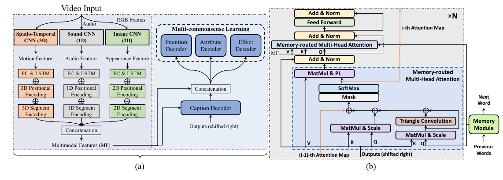
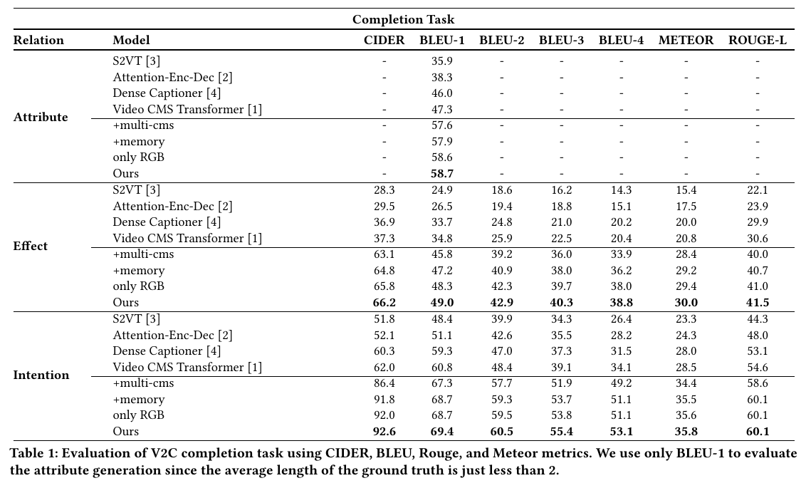
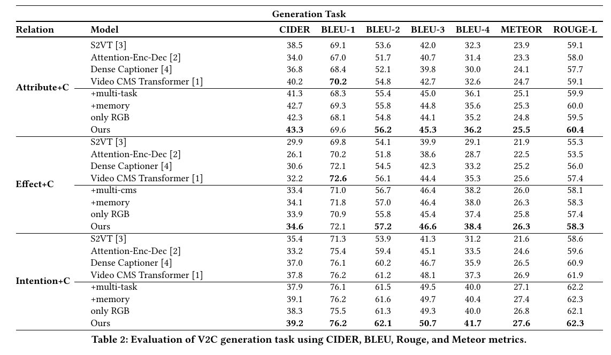

# Hybrid Reasoning Network for Video-based Commonsense Captioning


## Introduction
This repository contains source code for our **ACM MM 2021**: [Hybrid Reasoning Network for Video-based Commonsense Captioning]().


## Dataset
V2C dataset in [V2C_annotations.zip](https://drive.google.com/file/d/1qt0JsOAqBsdCTlDUw0gw7c_IosShysoW/view?usp=sharing), which consists:
    
    V2C_annotations.zip
    ├── msrvtt_new_info.json                      # MSR-VTT captions and token dictionary.
    ├── v2c_info.json                             # V2C Raw, captions/CMS, and token dictionary.
    ├── V2C_MSR-VTT_caption.json                  # V2C Raw, captions/CMS after tokenization.
    ├── train_cvpr_humanRank_V2C_caption.json     # a human re-verified clean split for V2C annotations.
    └── v2cqa_v1_train.json                       # for V2C QA, consisting captions, CMS, and CMS related questions/answers.

## Video Features
we use the pre-trained models including ResNet152, SoundNet and I3D  to extract the appearance feature, audio feature and motion feature, respectively  
Video Features data in [***]()
## Architecture



## Training and Testing
Enviroment: This implementation was complemented on PyTorch-1.8.1, there was reported some errors if newer version PyToch is usednad  we will work on a updation for that later.
                

E.g., to initiate a training on **intention** prediction tasks (set --cms 'int'), with 1 RNN video encoder layer, and 6 transformer decoder layers with 8 attention heads, 64 head dim, and 1024 model dim, for 600 epochs under CUDA mode, and shows intermedia generation examples:
```python
python train.py --cms int --batch_size 64 --epochs 600 --num_layer 6 --dim_head 64 --dim_inner 1024 \
                --num_head 8 --dim_vis_feat 2048 --dropout 0.1 --rnn_layer 1 --checkpoint_path ./save \
                --info_json data/v2c_info.json --caption_json data/V2C_MSR-VTT_caption.json \
                --print_loss_every 20 --cuda --show_predict   
```

For completion evaluations:
```python
python test_cms.py  --cms int --batch_size 64 --num_layer 6 --dim_head 64 --dim_inner 1024 \
                    --num_head 8 --dim_vis_feat 2048 --dropout 0.1 --rnn_layer 1 --checkpoint_path ./save  \
                    --info_json data/v2c_info.json --caption_json data/V2C_MSR-VTT_caption.json  \
                    --load_checkpoint save/**.pth --cuda
```
For generation evaluations:
```python
python test_cap2cms.py  --cms int --batch_size 64 --num_layer 6 --dim_head 64 --dim_inner 1024 \
                        --num_head 8 --dim_vis_feat 2048 --dropout 0.1 --rnn_layer 1 --checkpoint_path ./save  \
                        --info_json data/v2c_info.json --caption_json data/V2C_MSR-VTT_caption.json \
                        --load_checkpoint save/*.pth --cuda
```


## Model Zoo
Download [MODEL_ZOO.zip]() for the trained captioning models for intention, effects and attributes generations.


## Quantitative Results for V2C-completion



## Citations
Please consider citing this paper if you find it helpful:
```
@inproceedings{
    title = "Hybrid Reasoning Network for Video-based Commonsense Captioning"
}
```


